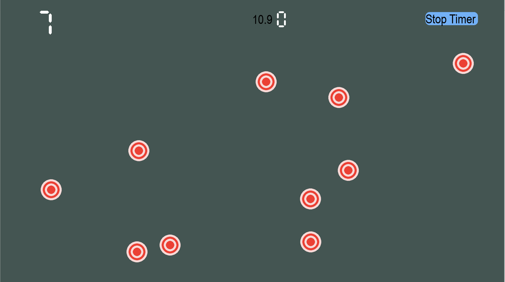

# learningPython
 
- I actually forgot I made this a while ago, but I was going back through my projects as I continue to learn python and found this.
- I had made this several months ago, and it was simply a way for me to mess around in python and with pygame
- I made a sort of "Aim Trainer" type game, with my own custom seven segment display and targets
